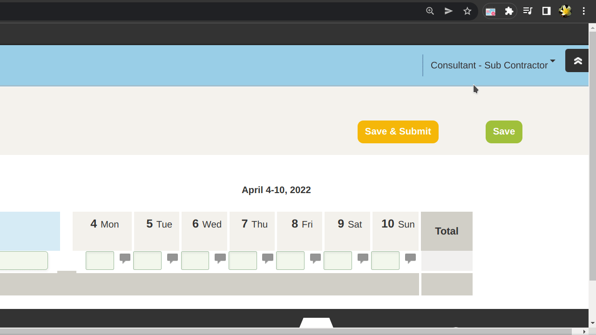

:doctype: article
:doctitle: Tempo to Openair
:toc: preamble
:toclevels: 2
:source-highlighter: highlight.js
:highlightjs-languages: typescript
:icons: font

Tempo to Openair copies your tracked Tempo worklogs into your Openair timesheet.

https://github.com/miracoly/tempo-openair-chrome-extension/releases/latest/[image:https://img.shields.io/badge/Chrome_Extension-v1.0.0--alpha.3-blue?style=for-the-badge&logo=google-chrome&logoColor=white[Chrome Extension Tempo to Openair]]

* [x] Automatically copy your weekly worklogs from Tempo into your Openair timesheet.
* [x] Duplicate Tasks per day get accumulated.
* [x] Only copy tasks of a specific Tempo issue key, e.g.  TIME-123.
* [x] Syncs your settings with your Google account

{empty} +

toc::[]

== Install
1. Download the https://github.com/miracoly/tempo-openair-chrome-extension/releases/latest/[latest Release as zip archive] and extract it.
2. Go to `chrome://extensions/` in your Chrome browser and enable `Developer mode` in the upper right corner.
3. Click `Load unpacked` and select the directory of the extracted zip archive.

The extension is now ready to use. To update to a newer release remove the extracted folder and repeat the above steps.

== Configure
If you click on the extension, a popup opens which asks you to provide the *ticket number* and an *api token* for your Tempo account.

[discrete]
=== Ticket number
A Tempo ticket has an issue key like `TIME-123`. Here, your ticket number would be `123`.

[discrete]
=== Api token
* Go to your tempo app.
* Under `Settings > Data Access > API Integration` click `+ New Token`.
* Chose a name, set expiration as you like and select `Custom Access`.
* It is sufficient to only select `Worklogs scope > View worklogs`.

== Usage
1. Go to you Openair app and open a weekly timesheet.
2. Open the extensions popup and click `Fill Timesheet`.

That's it. Submit your timesheet.

== For Developers
=== Overview
* Chrome Extension: https://developer.chrome.com/docs/extensions/reference/[API Reference]

==== manifest.json
Main configuration file for a Chrome extension. Here you define permissions etc.

==== popup.ts
Script file for `popup.html`, which defines the view of the extensions popup.

==== content.ts
Gets injected into the website, if matched with urls inside `manifest.json`.

[source,json]
.manifest.json
----
"content_scripts": [
  {
    "matches": ["https://*.app.openair.com/*"],
----
`content.js` has access to the sites DOM and can interact with it. Requests to other domains get send from the page itself and therefore get blocked by CORS.

==== background.ts
Functions as a service-worker in the background, like the backend of an extension. From here, you can fetch other domains which are listed inside `manifest.json`.

[source,json]
.manifest.json
----
"host_permissions": ["https://api.tempo.io/*"],
----

=== Build
==== For Production
* `npm run build`

==== For Development
* `npm run watch`
* Generate styles: `npx tailwindcss -i ./src/popup/styles.css -o ./dist/styles.css`

=== Logging
- `console.log()` in `content.ts` gets logged in normal page console.
- `background.ts` and `popup.ts` logs get printed to different console. To view, right-click extension icon in chrome menu and click `Inspect Popup`.

== Credits
- Logo created by https://www.flaticon.com/free-icons/calendar[Maxim Basinski Premium - Flaticon]
